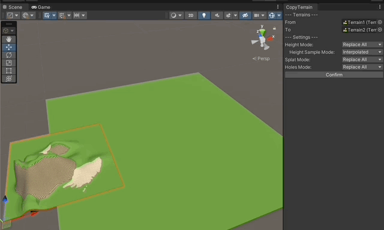

# Copy Terrain
A simple editor window that allows you to copy one terrain onto another.

Supports:
- Height map
- Splat map
- Holes map
- Rotation (Unity does show terrain rotation, but the script will use the Y-axis rotation fo the terrains)
- Multiple settings for each map type (Replace All, Replace Area, Max, Min, Average)
- Undo functionality

Note: Back up your terrains before using this tool.  While there is undo functionality, better safe than sorry.

